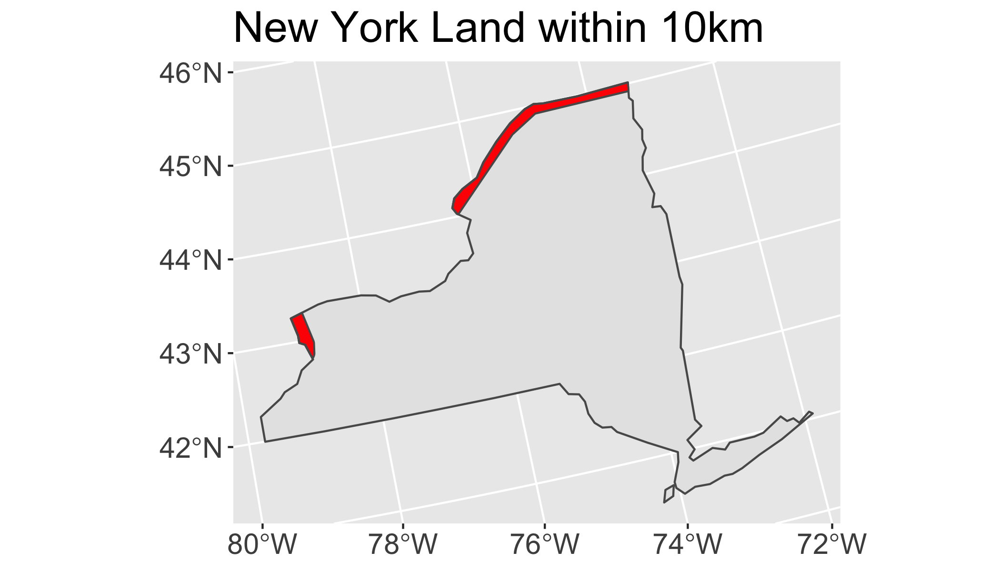

# Reading

- The [Spatial Features Package (sf)](https://r-spatial.github.io/sf/){target='blank'}

# Background
Up to this point, we have dealt with data that fits into the tidy format without much effort. Spatial data has many complicating factors that have made handling spatial data in R complicated. Big strides are being made to make spatial data tidy in R. 


# Objective

You woke up in the middle of the night terrified of the Canadians after a bad dream.  You decide you need to set up military bases to defend the Canada-NY border. After you tweet your plans, you realize you have no plan.  What will you do next?

> 1) Generate a polygon that includes all _land_ in NY that is within 10km of the Canadian border (not including the great lakes).
> 2) Calculate it's area in km^2.  How much land will you need to defend from the Canadians?


# Tasks

- Reproject spatial data using `st_transform()`
- Perform spatial operations on spatial data (e.g. intersection and buffering)
- Generate a polygon that includes all land in NY that is within 10km of the Canadian border and calculate the area
- Save your script as a .R or .Rmd in your course repository

[<i class="fa fa-file-code-o fa-1x" aria-hidden="true"></i> Download starter R script (if desired)](scripts/CS_05_nocomments.R){target="_blank"}


<div class="well">
<button data-toggle="collapse" class="btn btn-primary btn-sm round" data-target="#demo1">Show Hints</button>
<div id="demo1" class="collapse">
The details below describe one possible approach.

## Libraries
You will need to load the following packages

```r
library(spData)
library(sf)
library(tidyverse)
# library(units) #this one is optional, but can help with unit conversions.
```

## Data

```r
#load 'world' data from spData package
data(world)  
# load 'states' boundaries from spData package
data(us_states)
# plot(world[1])  #plot if desired
# plot(us_states[1]) #plot if desired
```

## Steps
1. `world` dataset
    1. transform to the albers equal area projection:
    
    ```r
    albers="+proj=aea +lat_1=29.5 +lat_2=45.5 +lat_0=37.5 +lon_0=-96 +x_0=0 +y_0=0 +ellps=GRS80 +datum=NAD83 +units=m +no_defs"
    ```
it easier to use `ggplot()`
    2. filter the world dataset to include only `name_long=="Canada"` 
    3. buffer canada to 10km (10000m)
2. `us_states` object    
    1. transform to the albers equal area projection defined above as `albers`
    2. filter the `us_states` dataset to include only `NAME == "New York"`
3. Create a 'border' object
    1. use `st_intersection()` to intersect the canada buffer with New York (this will be your final polygon)
    2. Plot the border area using `ggplot()` and `geom_sf()`.
    3. use `st_area()` to calculate the area of this polygon.
    4. Convert the units to km^2.  You can use `set_units(km^2)` (from the `units` library) or some other method.
4. Do not worry about small waterways, etc.  Just use the two datasets listed above.

</div>
</div>

Your final result should look something like this:

<!-- -->

Important note:  This is a crude dataset meant simply to illustrate the use of intersections and buffers.  The two datasets are not adequate for a highly accurate analysis.  Please do not use these data for real military purposes.

<div class="extraswell">
<button data-toggle="collapse" class="btn btn-link" data-target="#extras">
Extra time? Try these extra activities...
</button>
<div id="extras" class="collapse">

Build a leaflet map of the same dataset.


<iframe id="test"  style=" height:400px; width:100%;" scrolling="no"  frameborder="0" src="CS05_leaflet.html"></iframe>


</div>
</div>
