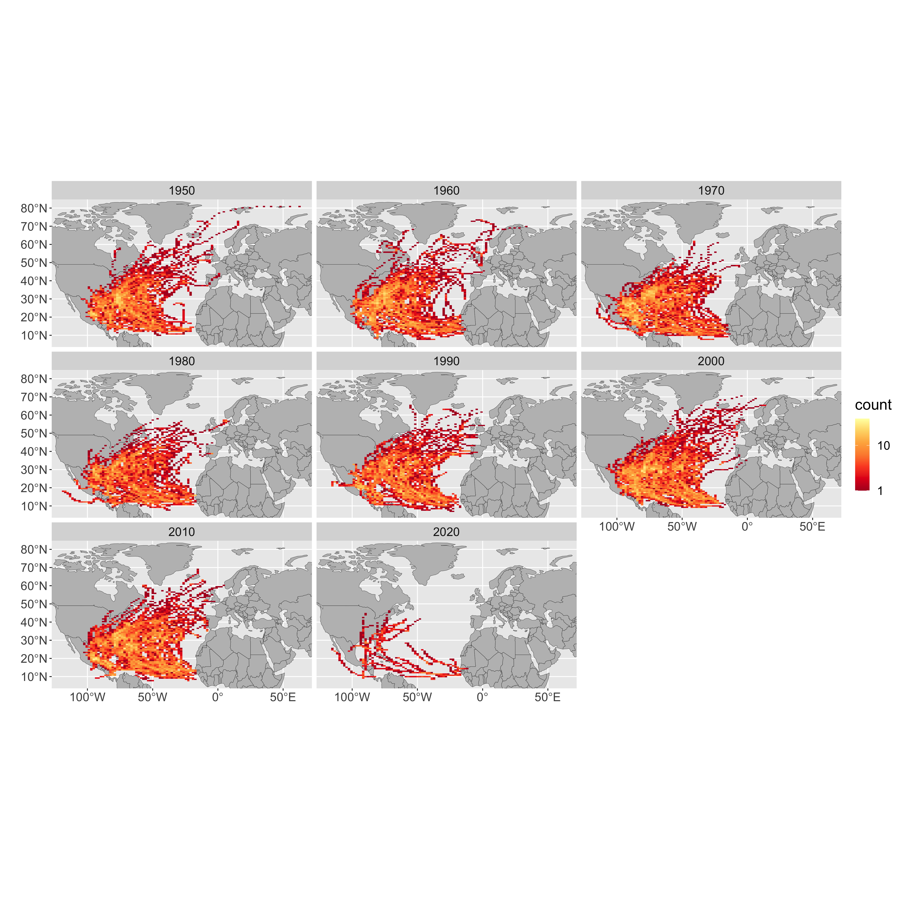
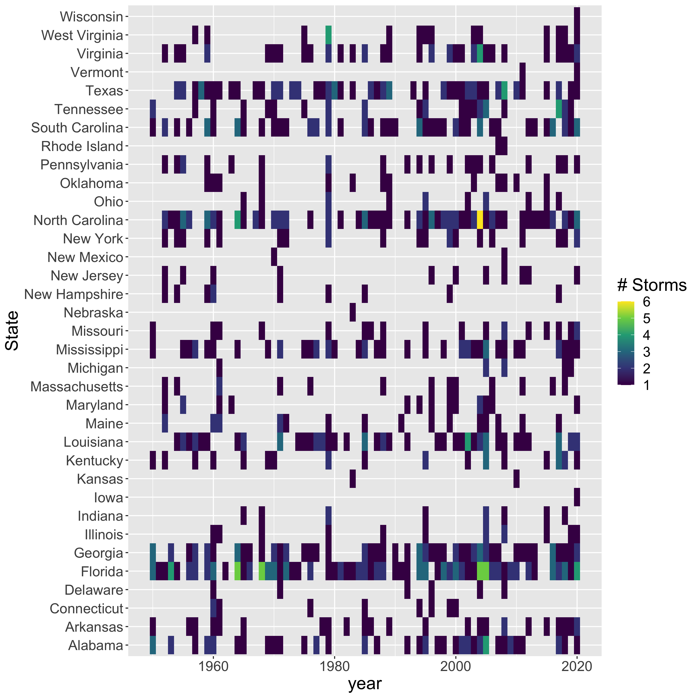

# Reading

- Overview of the [International Best Track Archive for Climate Stewardship (IBTrACS)](https://www.ncdc.noaa.gov/ibtracs/index.php?name=ibtracs-data-access)
- Performing [Spatial Joins with sf](https://r-spatial.github.io/sf/reference/st_join.html)

# Tasks

- Write a .Rmd script to perform the following tasks
- Use an API to access NOAA Storm data over the web
- Intersect the storms with US states to quantify how many storms in the database have hit each state.

## Libraries & Data


```r
library(sf)
library(tidyverse)
library(ggmap)
library(rnoaa)
library(spData)
data(world)
data(us_states)
```

## Objective

In this case study you will download storm track data from NOAA, make a summary plot, and quantify how many storms have hit each of the United States.  This will require you to use a spatial join (`st_join`).

### Your goal

```r
# Doesn't work in October 2020.
storms <- storm_shp(basin = "NA")
storm_data <- read_sf(storms$path)
```


```r
# 2020 update - it appears NOAA changed the URL which broke the R function.  Use the following instead of storm_shp().
dataurl="https://www.ncei.noaa.gov/data/international-best-track-archive-for-climate-stewardship-ibtracs/v04r00/access/shapefile/IBTrACS.NA.list.v04r00.points.zip"
tdir=tempdir()
download.file(dataurl,destfile=file.path(tdir,"temp.zip"))
unzip(file.path(tdir,"temp.zip"),exdir = tdir)
list.files(tdir)
```

```
## [1] "IBTrACS.NA.list.v04r00.points.dbf" "IBTrACS.NA.list.v04r00.points.prj"
## [3] "IBTrACS.NA.list.v04r00.points.shp" "IBTrACS.NA.list.v04r00.points.shx"
## [5] "temp.zip"
```

```r
storm_data <- read_sf(list.files(tdir,pattern=".shp",full.names = T))
```


Your desired figure looks something like the following:
<!-- -->


Calculate a table of the five states that have experienced the most storms.
<table class="table" style="margin-left: auto; margin-right: auto;">
 <thead>
  <tr>
   <th style="text-align:left;"> state </th>
   <th style="text-align:right;"> storms </th>
  </tr>
 </thead>
<tbody>
  <tr>
   <td style="text-align:left;"> Florida </td>
   <td style="text-align:right;"> 82 </td>
  </tr>
  <tr>
   <td style="text-align:left;"> North Carolina </td>
   <td style="text-align:right;"> 61 </td>
  </tr>
  <tr>
   <td style="text-align:left;"> Georgia </td>
   <td style="text-align:right;"> 55 </td>
  </tr>
  <tr>
   <td style="text-align:left;"> Texas </td>
   <td style="text-align:right;"> 52 </td>
  </tr>
  <tr>
   <td style="text-align:left;"> South Carolina </td>
   <td style="text-align:right;"> 47 </td>
  </tr>
</tbody>
</table>


<div class="well">
<button data-toggle="collapse" class="btn btn-primary btn-sm round" data-target="#demo1">Show Hints</button>
<div id="demo1" class="collapse">

## Steps

1. Use the API to Download storm data
   * Use `storm_shp()` for `basin = "NA"`
   * Read the points in with `storm_shp_read()`
   * Convert to `sf` format with `st_as_sf()`
2. Wrangle the data
   * Filter to storms 1950-present with `filter()`
   * Use `mutate_if()` to convert `-999.0` to `NA` in all numeric columns with the following command from the `dplyr` package: `mutate_if(is.numeric,` `function(x) ifelse(x==-999.0,NA,x))`
   * Use the following command to add a column for decade: `mutate(decade=(floor(year/10)*10))`
   * Use `st_bbox()` to identify the bounding box of the storm data and save this as an object called `region`.
3.  Make the first plot
   * Use `ggplot()` to plot the `world` polygon layer and add the following:
   * add `facet_wrap(~decade)` to create a panel for each decade
   * add `stat_bin2d(data=storms,` `aes(y=st_coordinates(storms)[,2],` `x=st_coordinates(storms)[,1]),bins=100)`
   * use 
`scale_fill_distiller(palette="YlOrRd",` 
`trans="log",` 
`direction=-1,`
`breaks = c(1,10,100,1000))` to set the color ramp
   * use `coord_sf(ylim=region[c(2,4)],`
   `xlim=region[c(1,3)])` to crop the plot to the region.
4. Calculate table of the five states with most storms.
   * use `st_transform` to reproject `us_states` to the reference system of the `storms` object (you can extract a CRS from a sf object with `st_crs(storms)`
   * Rename the `NAME` column in the state data to `state` to avoid confusion with storm name using `select(state=NAME)`
   * Perform a spatial join between the storm database and the states object with: `storm_states <- st_join(storms, states, `
   `join = st_intersects,left = F)`.  This will 'add` the state to any storm that was recorded within that state.
   * Use `group_by(state)` to group the next step by US state
   * use `summarize(storms=length(unique(NAME)))` to count how many unique storms occurred in each state.
   * use `arrange(desc(storms))` to sort by the number of storms in each state
   * use `slice(1:5)` to keep only the top 5 states
```


</div>
</div>

---

<div class="extraswell">
<button data-toggle="collapse" class="btn btn-link" data-target="#extras">
Extra time? Try this...
</button>
<div id="extras" class="collapse">


Try to replicate the following graphic using the data you transformed above.


```
## `summarise()` regrouping output by 'state' (override with `.groups` argument)
```

<!-- -->

Can you sort the rows (states) in order of storm frequency (instead of alphabetical)?
</div>
</div>
