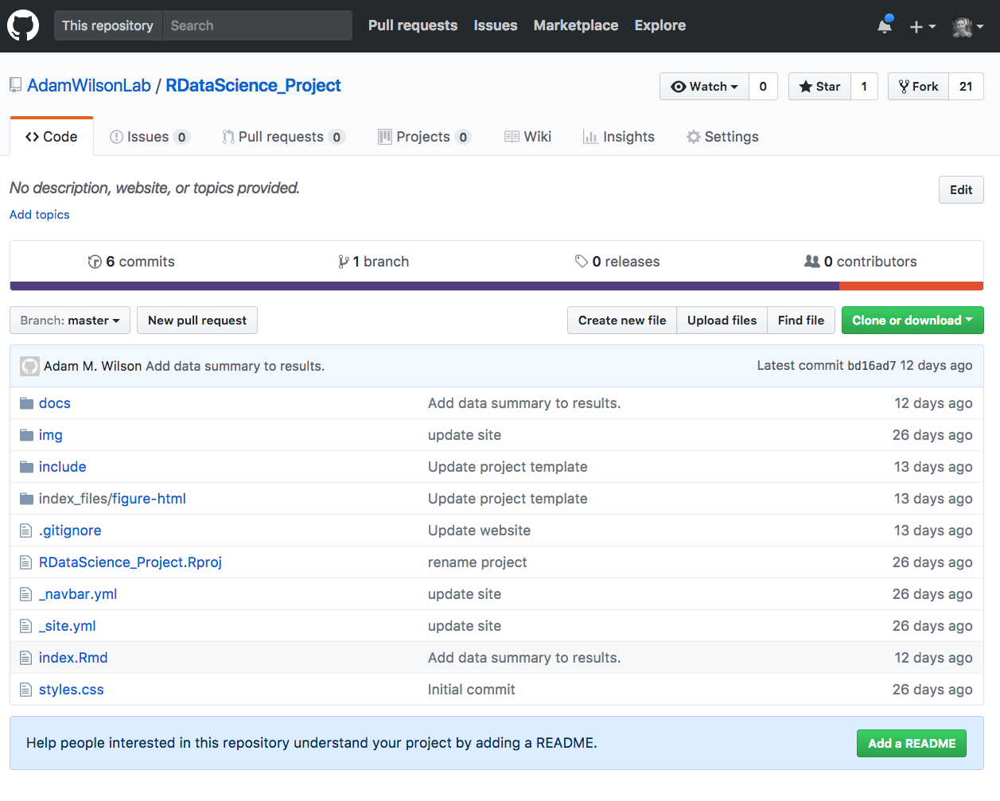
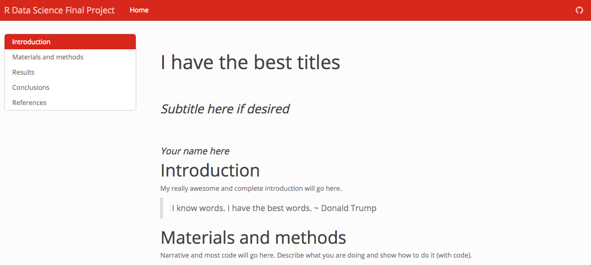

## Description

The final project will consist of a poster-length report summarizing an analysis of your choice, coded in R, and presented within a R Markdown document.  The topic can be related to your research interests or a separate topic.

Your project does not have to involve big data or complicated analyses.  I'm looking for a demonstration of your creativity and programming skills.  A small, well designed project is better than a large, incomplete one.  Please focus on quality over quantity.

One limitation is that your project must use publicly accessible data. If you want to use your own data, you must make it available on a website (e.g. [Figshare](figshare.org) or [Github](github.com)) so that others are able to re-run your code. Also check out [ROpenSci](https://ropensci.org/packages/) which has libraries that can pull data from many different sources.  You can also download data from publicly accessible servers.

## Project Phases

### Project Proposal

The project proposal will  about 1 page in length and include the following:

1.  Introduction to problem/question
2.  Links to inspiring examples:  Include links and screenshots of a few (~3-5) example graphics found on the internet that convey what you want to do.  Include a few sentences about why you selected each link.
2.  Proposed data sources: Be as specific as possible.
3.  Proposed methods: List the approach you will use. Don't simply list packages, tell me what you will do with them.
4.  Expected results: Describe what you want to produce (graphics, analyses, etc.)

Finding good data takes time, and can take longer than the time to tidy your data.  This task could easily take 3-6 hours to find the data you need for your project.  After you find good data sources make sure to complete the remaining tasks.

Use [this template (which is an R Markdown File) for your project proposal](scripts/Project_ProposalTemplate.Rmd).  You can see what this file looks like 'after rendering' [here](Project_ProposalTemplate.html).

### First Draft

The first draft of your project will be assessed by your peers in GitHub. The objectives of the peer evaluation are:

* Expose you to the work of your peers so you know what others are working on
* Provide an opportunity to share your knowledge to improve their project

You should use the project website template (or similar) to generate a html version of your project report. If your project requires any data not available in public repositories, you should put it in a folder called `/data` in your project's home directory and then import it into R with `read.csv('data/filname.csv')` or similar so that anyone with a copy of the repository can re-create the HTML output.

#### Submission Instructions

1. **PREFERRED OPTION:** Submit links to your GitHub repository _and_ website.
    * Your project repository looks something like this:
        
    * Your public website link looks something like this:
        

#### Evaluation Instructions

Select two repositories and evaluate them according to the instructions and rubric below.  

1) Explore the final projects in the [class repositor](https://github.com/AdamWilsonLabEDU)
2) Open the repository and check if there have already been two reviews by checking if there are 2 (or more) "Pull Requests".  For example, in the image below, there are 0 pull requests, so this repository would be available for you to review.  If there are already 2 pull requests, select another repository. 
2) Go to the GitHub page linked in the assignment and download the repository as a zip file (click on the  button).
3) Unzip the file after it downloads
4) Open the project or `index.Rmd` in RStudio and click `knit` or  `Build Website` in the `Build` tab in the upper right.

Evaluate the following provide any feedback via pull request.
1) Website
  1) **Introduction**  [~ 200 words]: Clearly stated background and questions / hypotheses / problems being addressed. Sets up the analysis in an interesting and compelling way.
  2) **Data**: Script downloads at least one data set automatically through the internet.  This could use a direct download (e.g. download.file()) or an API (anything from ROpenSci).
  3) **Figure**: The HTML file includes at least one figure of the data.
2) **Output:** The .Rmd produces HTML output with
  1) section headers for all the major sections of the paper
  2) a draft of the complete introduction.  

Be sure to install any required libraries (do not complain if it fails because you don't have a library installed).

### Final Draft

Links to your project website will be uploaded to UBLearns at the end of the semester and posted on the course website.  

The final project will include the following components:

1. **Title** (<25 words)
2. **Introduction  [~ 200 words]**
    * Clearly stated background and questions / hypotheses / problems being addressed. Sets up the analysis in an interesting and compelling way.
3. **Materials and methods [~ 200 words]**
    * **Narrative**: Clear narrative description of the data sources and methods. Includes data from at least two sources that were integrated / merged in R.
    * **Code**: The code associated with the project is well organized and easy to follow. Demonstrates mastery of R graphics and functions.
    * **Data**: The underlying data are publicly accessible via the web and downloaded/accessed within the Rmd script. If you want to use your own data, you must make it available on a website (e.g. [Figshare](figshare.org)) so that others are able to re-run your code.
4. **Results [~200 words]**
    * Tables and figures (maps and other graphics) are carefully planned to convey the results of your analysis. Intense exploration and evidence of many trials and failures. The author looked at the data in many different ways before coming to the final presentation of the data.
5. **Conclusions [~200 words]**
    * Clear summary adequately describing the results and putting them in context. Discussion of further questions and ways to continue investigation.
6. **References**
    * All sources are cited in a consistent manner
7. **General Scores**
    * **General organization**: Clear labels/headings demarcate separate sections. Excellent flow from one section to the next. Tables and graphics carefully tuned and placed for desired purpose.The 'story' is very well organized, makes good use of graphics, and is easy to understand.
    * **General Grammar**: All sentences are well constructed and have varied structure and length. The author makes no errors in grammar, mechanics, and/or spelling.

Note that the word counts are quite short (~200 words per section).  This does not mean it's _easy_!  In fact, conveying all the necessary information succinctly requires extra effort.  If English is not your first language, you are encouraged to contact the [UB Writing Center](https://www.buffalo.edu/writing.html) to get help writing succinctly and clearly.  They schedule 45 minute sessions to go over your writing which can dramatically improve the quality of your project. Plan ahead to schedule this before upcoming deadlines.

The more complete the second draft, the more feedback I'll be able to provide to ensure an excellent final project.  So it's in your interest to finish as much as possible.    In addition to the details from the first draft, I would like to see drafts of the text and figures/tables/etc in each section.  

When submitting your your second draft, you can include any questions or comments in the draft (e.g., "I'm planning to do X, but I'm not sure how to organize the data appropriately") or as a _comment_ in the UBLearns submission webpage.  Please do not include these comments in the final submission.

#### Formatting
The final project will be produced as a [RMarkdown Website](http://rmarkdown.rstudio.com/rmarkdown_websites.html) that includes all the steps necessary to run the analysis and produce the output (figures, tables,etc.).  For examples of similar documents, explore the [RPubs website](https://rpubs.com). 

See the [RMarkdown page](http://rmarkdown.rstudio.com/formats.html) for ideas on different html output designs.  In particular, check out the [FlexaDashboard](http://rmarkdown.rstudio.com/flexdashboard/) options if you want to include interactive displays.

#### Figures
Figures (maps and other graphics) are a vital component of scientific communication and you should carefully plan your figures to convey the results of your analysis.

#### References
You should cite any relevant materials (including data sources and methods) in the text using a standard author-date citation format (e.g. Wilson, 2015) and then described in a References section.  You can either compile the references manually (e.g. cutting and pasting the citation into the references section) or use the automated system in RMarkdown explained [here](http://rmarkdown.rstudio.com/authoring_bibliographies_and_citations.html).   Other citation styles are acceptable as long as they are consistent, complete, and easy to understand.  

### Project Ideas

* Summarizing citizen science data collected at the University at Buffalo
* 

### Resources

Sites with examples of visual display of quantitative information 

* [http://www.informationisbeautiful.net](http://www.informationisbeautiful.net)
* [http://flowingdata.com](http://flowingdata.com)
* [https://visual.ly/m/design-portfolio/](https://visual.ly/m/design-portfolio/) 
* [40 Brilliant and Complex Topics Explained Perfectly By Infographics](https://designschool.canva.com/blog/best-infographics/)
* [NY Times Graphics Department](https://twitter.com/nytgraphics)
* [Open Data through R](https://github.com/ropensci/opendata): This Task View contains information about using R to obtain, parse, manipulate, create, and share open data. Much open data is available on the web, and the WebTechnologies TaskView addresses how to obtain and parse web-based data. There is obvious overlap between the two TaskViews, so some packages are described on both. There is also a considerable amount of open data available as R packages on CRAN.

## References

Suggestions for lightening presentations adapted from the [Software Sustainability Institute](https://www.software.ac.uk/home/cw11/giving-good-lightning-talk).
