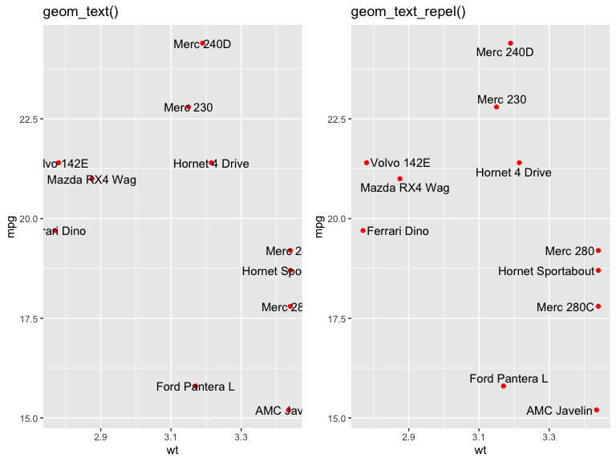
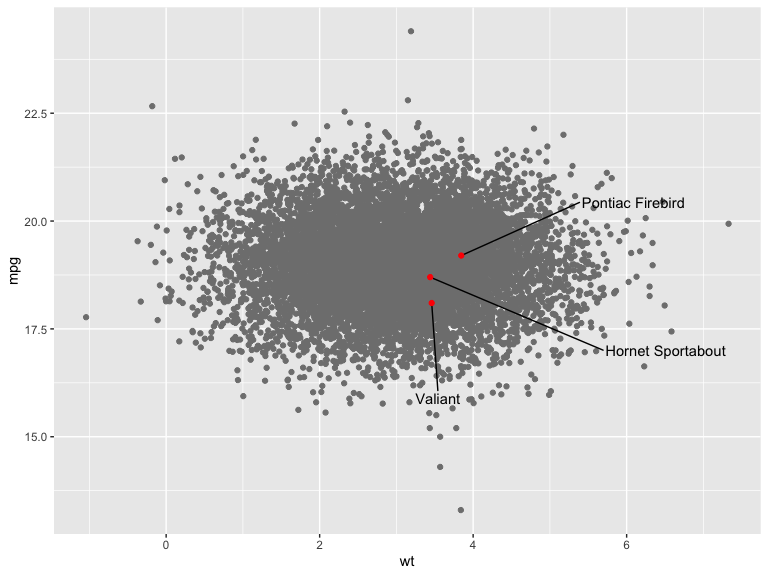

## Lead Author: Kamil Slowikowski 


* computational biologist
   * analysis of functional genomics data 
   * cell regulation of functions in disease 
* software tools for statistical tests and data visualization

## ggrepel

### geoms for [ggplot2] to repel overlapping text labels

[ggplot2]: http://ggplot2.tidyverse.org/

Text labels repel away from each other, away from data points, and away
from edges of the plotting area.

Two main functions:

* `geom_text_repel()`
* `geom_label_repel()`


## Compare `geom_text()` and `geom_text_repel()`


```r
p <- ggplot(dat, aes(wt, mpg, label = car)) +
  geom_point(color = "red")

p1 <- p + geom_text() + labs(title = "geom_text()")

p2 <- p + geom_text_repel() + labs(title = "geom_text_repel()")

gridExtra::grid.arrange(p1, p2, ncol = 2)
```

## Comparison



## Options

ggrepel provides additional options for `geom_text_repel` and `geom_label_repel`:

|Option          |  Description
|--------------- |  ------------------------------------------------
|`force`         |  force of repulsion between overlapping text labels
|`direction`     |  move text labels "both" (default), "x", or "y" directions
|`max.iter`      |  maximum number of iterations to try to resolve overlaps
|`nudge_x`       | adjust the starting x position of the text label
|`nudge_y`       |  adjust the starting y position of the text label
|`segment.color` | line segment color
|`segment.size`  | line segment thickness
|`segment.curvature` | numeric, negative for left-hand and positive for right-hand curves, 0 for straight lines
|`segment.angle` | 0-180, less than 90 skews control points toward the start point
|`arrow`         |  render line segment as an arrow with `grid::arrow()`

## Another example


