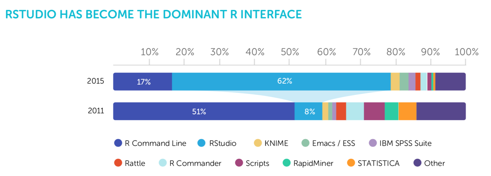

## Today's plan
1. Who am I?
2. Who are You?
3. Course Overview
5. What is R? 
6. Who uses R?

# Introductions

## Adam M. Wilson

Associate Professor of Global Environmental Change 
Geography Department

I Use R:

* GIS (with a little GRASS)
* Statistics
* Visualizations
* HTML/Websites (including this one!)

## Who are you?

* Name
* Degree and Department 
   * _e.g. Masters in GIS in Geography_
* Something about you (< 1 minute, please)
   * Maybe:
      * Why you are taking this class
      * Something you want to learn / do
      * What you did over the summer

# Course Overview

## Spatial Data Science

</img>
--Grolemund & Wickham, R for Data Science, O'Reilly 2016

## Course Learning Objectives

1. Convert data from varied formats/structures to desired format for analysis and visualization
2. Clean, transform, and merge data attributes/variables appropriately
3. Effectively display and communicate meaning from spatial, temporal, and textual data
4. Use current analysis, presentation, and collaboration tools in the spatial data science field.

This course is NOT a statistics course (see GEO 505, etc.). 

## In other words:   become an R wizard!

## Tools

* R
* RStudio
* Slack
* DataCamp
* Git (Version Control)

## Course Structure

<iframe
  src="http://wilsonlab.io/GEO511"
  width="100%" height="800">
</iframe>
[source](http://wilsonlab.io/GEO511)

## Weekly Rhythm

1. **Preparation**   
    a. Read Assigned Material   
    b. Work on class tasks and DataCamp assignments
    c. Submit questions for class discussion on Slack
2. **Class Time Tuesday**
    a. Case Study Team Meetings via Zoom (if desired)
3. **Continue Preparation**   
    a. Finish case studies and prepare to present
    d. Prepare Resource Presentation (once / semester)
4. **Class Time Thursday**   
    a. Updates & Questions from reading and daily class tasks [~10 minutes]  
    b. Student Resource Presentation(s) [20 minutes]   
    c. Case Study Presentation [30 minutes]
        * One group [randomly] selected to share solution
        * Other groups share other approaches / solutions
    d. Case Study Introduction (for following week) [20 minutes]
5. **Rinse and Repeat**   

## Time committment

Plan to spend approximately 5-11 hours each week:

* DataCamp courses: 3-5
* Weekly Tasks: 1
* Case Studies: 1-5
* Project will require more time near end of semester.

## Course Schedule
<iframe
  src="http://wilsonlab.io/GEO511/Schedule.html"
  width="100%" height="800">
</iframe>
[source](http://wilsonlab.io/GEO511/Schedule.html)

## Tasks for this week

<iframe
  src="http://wilsonlab.io/GEO511/TK_01.html"
  width="100%" height="800">
</iframe>
[source](http://wilsonlab.io/GEO511/TK_01.html)

## Case Study for this week

<iframe
  src="http://wilsonlab.io/GEO511/CS_01.html"
  width="100%" height="800">
</iframe>
[source](http://wilsonlab.io/GEO511/CS_01.html)

## Groups in this course

* 5 groups of ~3-4 students
* Keep through the first few weeks (at least)
* Objectives:
    * build community
    * work as a team on case studies

## Meet your group

* 10 minute breakout session
* Topics
   * Introduce again
   * Do you have any experience writing code? (if so, which languages, etc.)?
   * What do you hope to learn from this course?
   * What activity did you enjoy this summer?
* After ~10 minutes, we'll return to single group to summarize 

# What is R and who uses it?

## R Project for Statistical Computing

* Free and Open source
* Data manipulation
* Data analysis tools
* Great graphics
* Programming language
* 6,000+ free, community-contributed packages
* A supportive and increasing user community

R is a dialect of the S language  developed at Bell Laboratories (formerly AT&T) by John Chambers et. al. (same group developed C and UNIX©)

## What is the R environment?

* effective data handling and storage facility
* suite of operators for (vectorized) calculations
* large, coherent, integrated collection of tools for data analysis
* graphical capabilities (screen or hardcopy)
* well-developed, simple, and effective programming language which includes:
     * conditionals
     * loops
     * user defined functions
    * input and output facilities

## Custom Visualizations 

<iframe
  src="https://www.r-graph-gallery.com/"
  width="100%" height="800">
</iframe>
[source](https://www.r-graph-gallery.com/)

## Spatial Visualizations

<iframe
  src="https://www.r-graph-gallery.com/connection-map.html"
  width="100%" height="800">
</iframe>
[source](https://www.r-graph-gallery.com/connection-map.html)

## Spatial Data Processing in R

Packages: `sf, sp, maptools, rgeos, raster, ggmap`

R can perform many GIS functions and workflows (often better than a GIS!).

## Strengths & Limitations

* Just-in-time compilation
     * Slower than compiled languages (C+, etc.) <i class="fa fa-thumbs-o-down" aria-hidden="true"></i>
     * Faster to compose <i class="fa fa-thumbs-o-up" aria-hidden="true"></i> 
* Many available packages <i class="fa fa-thumbs-o-up" aria-hidden="true"></i>
* Most operations conducted in RAM
     * RAM can be limiting and/or expensive <i class="fa fa-thumbs-o-down" aria-hidden="true"></i>
     * `Error: cannot allocate vector of size X Mb`
     * Various packages and clever programming can overcome this… <i class="fa fa-thumbs-o-up" aria-hidden="true"></i>
* Free like beer **AND** speech! <i class="fa fa-thumbs-o-up" aria-hidden="true"></i>

## R Interface

</img>

But there are other options...

## RStudio

</img>

Mac, Windows, Linux, and over the web…

# Who uses R

## Popularity of Data Science Software
<iframe
  src="http://r4stats.com/articles/popularity"
  width="100%" height="800">
</iframe>
[source](http://r4stats.com/articles/popularity)

## Scholarly Articles

Number of scholarly articles found in the most recent complete year (2018) for the more popular data science software. To be included, software must be used in at least 750 scholarly articles.

## Interface to R

## R vs Python
<iframe
  src="https://s3.amazonaws.com/assets.datacamp.com/email/other/Python+vs+R+(1).png"
  width="100%" height="800">
</iframe>
[source](https://s3.amazonaws.com/assets.datacamp.com/email/other/Python+vs+R+(1).png)

## Many 'Cheatsheets' available

<iframe
  src="https://www.rstudio.com/resources/cheatsheets/"
  width="100%" height="800">
</iframe>
[source](https://www.rstudio.com/resources/cheatsheets/)

# Why code at all?

## Why write code when you can click?

</img>

Graphical User Interfaces are useful, especially when you are learning...

## Typical GUI Workflow
</img>

## Organized and repeatable workflow
</img>

## Learning a programming language can help you learn how to think logically.

<blockquote>
A man who does not know foreign language is ignorant of his own.
  -- Johann Wolfgang von Goethe (1749 - 1832)
</blockquote>

## Programming gives you access to more computer power.

<blockquote>
The computer is incredibly fast, accurate, and stupid. Man is unbelievably slow, inaccurate, and brilliant. The marriage of the two is a force beyond calculation.   -- Leo Cherne
</blockquote>

## From Graphical User Interface (GUI) to Scripting

</img>

## Parallel Processing
For BIG jobs:
multi-core processors / high performance computing with foreach.
</img>

